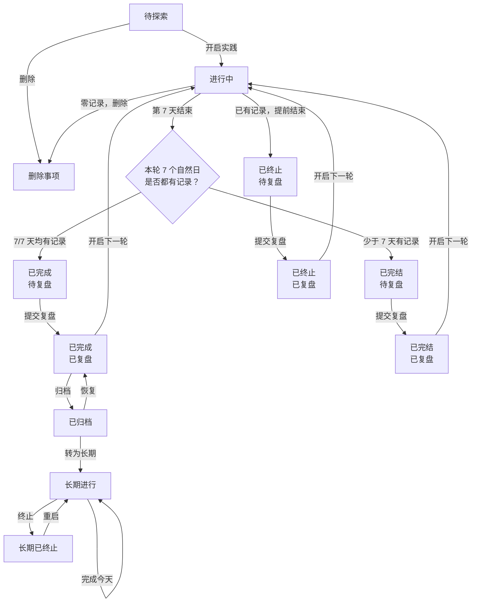

# 事项状态流

本文记录当前已确认并已实现的事项状态流。事项状态用于总库筛选和详情展示；周期状态用于判断某一轮 7 天实践的进行、结算和复盘。勋章规则见 [badge-rules.md](./badge-rules.md)。

## 关键规则

- 每轮固定为 7 个自然日。到期时，7 天均有每日记录即为“已完成”；其余情况为“已完结”。有效实践和未实践都计为有记录。
- 到期后不允许补记。完成或完结后都需要复盘，复盘不会改变该轮的结算结果。
- 提前结束只适用于本事项任一轮已有每日记录的情况，结果为“已终止，待复盘”。从未有过记录的事项直接删除，不保留“已作废”状态。
- 开启下一轮会保留全部历史周期和复盘，从新一轮的第 1 天开始；同一方向同一时间只能有一个进行中或待复盘事项。
- 只有已完成且已复盘的事项可以归档；已完结不能归档，只能开启下一轮或停留在已完结。归档恢复后回到“已完成，已复盘”。
- 已归档事项均来自已完成且已复盘的成功实践，可以转为长期事项。长期事项只记录“完成今天”的日期、累计天数和可选备注，不考核时长；可终止，也可重启。

## 状态筛选

总库支持多选状态条件，默认展示“进行中”。可选条件为：待探索、进行中、已终止、已完成、已完结、已归档、长期。长期条件同时包含“长期进行”和“长期已终止”。
